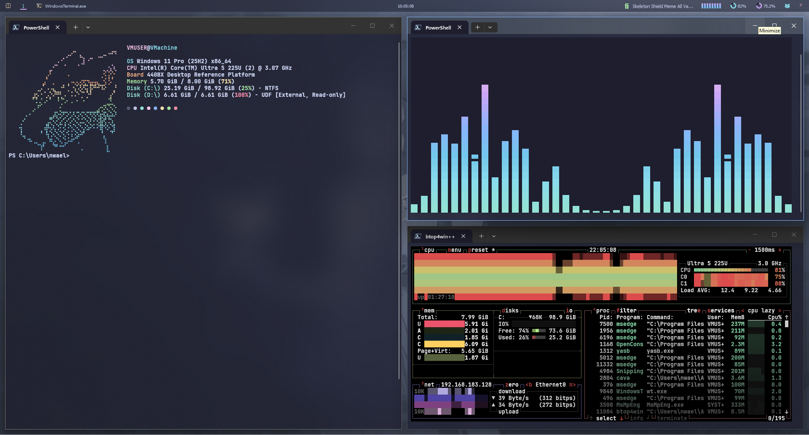
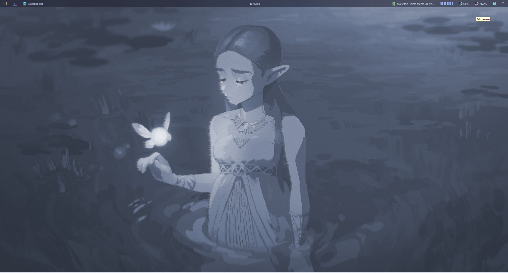
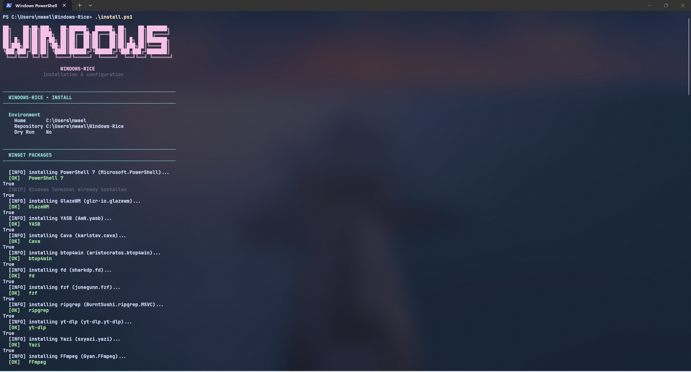
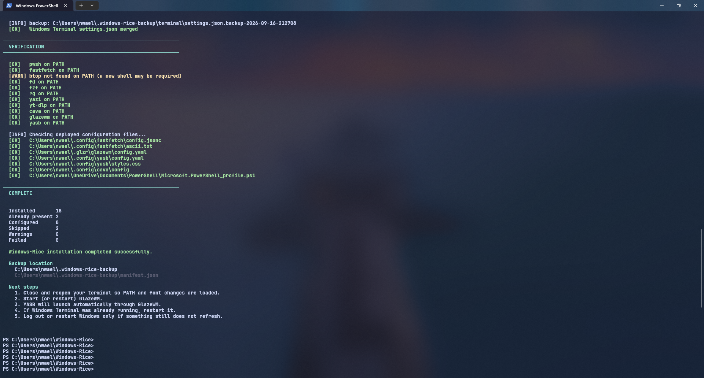

# Windows-Rice

A Windows 10/11 ricing setup built around GlazeWM and YASB, with PowerShell automation that installs the required software, deploys configuration files, protects existing user configuration with timestamped backups, and provides a matching uninstaller.

Windows-Rice is designed to be cloned, run once, and reversed cleanly. Existing files are only replaced after they have been backed up, and package removal is driven by a manifest so the uninstaller never removes software the user already had.



<details>
<summary>More screenshots</summary>







</details>

---

## Features

- Automated install of the desktop, terminal, and CLI components the rice depends on.
- Configuration deployment to per-user locations using `~` rather than hardcoded usernames.
- SHA256 comparison before replacement — identical files are left alone, no duplicate backups.
- Timestamped, per-component backups under `~/.windows-rice-backup/`.
- Non-destructive merge for Windows Terminal `settings.json`.
- Installation manifest so `uninstall.ps1 -RemovePackages` only removes packages Windows-Rice actually installed.
- Dry-run mode that reports what would happen without changing anything.
- Repeatable — safe to run `install.ps1` more than once.

---

## Components

The rice configures the following software.

### Desktop / UI

| Component | Role |
|---|---|
| GlazeWM | Tiling window manager |
| YASB | Status bar (top of screen) |
| CAVA | Audio visualizer, embedded in YASB |
| Fastfetch | System information shown on shell start |
| Windows Terminal | Terminal host |
| PowerShell 7 | Shell that hosts the profile |

### Terminal utilities

| Component | Role |
|---|---|
| btop | Resource monitor |
| fd | `find` replacement |
| fzf | Fuzzy finder |
| ripgrep | `grep` replacement |
| Yazi | Terminal file manager |
| yt-dlp | Media downloader |
| FFmpeg | Media toolkit (Yazi dependency) |
| 7-Zip | Archive support (Yazi dependency) |
| jq | JSON processor (Yazi dependency) |
| zoxide | Directory jump helper |
| ImageMagick | Image manipulation (Yazi previews) |

### Fonts

The canonical font used by every configuration file in the repository is:

```text
JetBrainsMono Nerd Font Mono
```

The installer installs this font through Scoop's `nerd-fonts` bucket. If the exact Mono variant cannot be resolved, the installer falls back to the non-Mono `JetBrainsMono-NF` variant so the rice remains usable.

Additional Nerd Fonts — Fira Code, Hack, Caskaydia Cove, Meslo, and Victor Mono — can be installed from the same `nerd-fonts` Scoop bucket for users who want them, but the repository's own configs reference only `JetBrainsMono Nerd Font Mono`.

### PowerShell

The PowerShell profile is intentionally minimal:

- sets UTF-8 input/output encoding,
- runs Fastfetch on shell start against `~/.config/fastfetch/config.jsonc`.

No prompt framework is used. Oh My Posh is not part of this project and is not installed.

---

## Repository Structure

```text
Windows-Rice/
├── install.ps1
├── uninstall.ps1
├── README.md
├── LICENSE
├── configs/
│   ├── yasb/
│   │   ├── default_yasb_config.yaml
│   │   └── styles.css
│   ├── glazewm/
│   │   └── default_glazewm_config.yaml
│   ├── cava/
│   │   └── config
│   ├── fastfetch/
│   │   ├── ascii.txt
│   │   └── config.jsonc
│   ├── powershell/
│   │   └── Microsoft.PowerShell_profile.ps1
│   └── terminal/
│       └── settings.json
├── assets/
│   ├── icons/
│   ├── wallpapers/
│   └── screenshots/
└── scripts/
```

| Path | Purpose |
|---|---|
| `install.ps1` | Installs packages, deploys configs, handles backups, and writes the installation manifest. |
| `uninstall.ps1` | Restores backed-up configurations and (optionally) removes only the packages Windows-Rice installed. |
| `configs/` | Source templates that the installer deploys to per-user locations. |
| `configs/yasb/` | YASB status bar: main YAML configuration and CSS. |
| `configs/glazewm/` | GlazeWM tiling window manager configuration. |
| `configs/cava/` | CAVA audio visualizer configuration. |
| `configs/fastfetch/` | Fastfetch system-info configuration and ASCII art. |
| `configs/powershell/` | PowerShell 7 profile deployed to the user's Documents folder. |
| `configs/terminal/` | Windows Terminal settings merged into the user's existing configuration. |
| `assets/icons/` | Icons used by the rice. |
| `assets/wallpapers/` | Wallpapers bundled with the repository, deployed per file with backup protection. |
| `assets/screenshots/` | Images used in this README. |
| `scripts/` | Reserved for auxiliary scripts. |

---

## Requirements

- Windows 10 or Windows 11.
- PowerShell 5.1 or later to *run* the installer (the installer will itself install PowerShell 7 for the rice).
- `winget` available (App Installer from the Microsoft Store).
- `git` if you are cloning the repository rather than downloading a ZIP.

No administrator privileges are required for the normal install path. Scoop installs into the current user's profile, and all configuration is deployed under the user's home directory.

---

## Installation

```powershell
git clone https://github.com/NitroBeast76/Windows-Rice.git
cd Windows-Rice
.\install.ps1
```

If Windows blocks the script the first time (the default execution policy does not allow downloaded scripts), run it via:

```powershell
PowerShell -ExecutionPolicy Bypass -File .\install.ps1
```

Or set the policy once for your user account:

```powershell
Set-ExecutionPolicy -Scope CurrentUser -ExecutionPolicy RemoteSigned
```

The installer proceeds in this order:

1. Detects the repository root from the location of `install.ps1`.
2. Resolves the current user's home, Documents folder, and per-user config paths.
3. Installs packages with `winget` and Scoop (unless `-SkipPackages`).
4. Installs the Nerd Font (unless `-SkipFonts` or `-SkipPackages`).
5. Deploys configuration files (`yasb`, `glazewm`, `cava`, `fastfetch`, PowerShell profile).
6. Deploys bundled wallpapers from `assets/wallpapers/`, if any are present.
7. Ensures PSReadLine is available (skipped when `-SkipPackages` is set).
8. Merges Windows Terminal settings (unless `-SkipTerminal`).
9. Writes an installation manifest listing packages it actually installed.
10. Verifies deployed files and command availability.
11. Prints a categorised summary: Installed, AlreadyInstalled, Configured, Skipped, Warnings, Failed.

---

## After the install

The installer puts everything on disk, but three components need a first
launch before they do anything useful. Do these in order.

### 1. Open a new terminal

Close the terminal you ran the installer in and open a fresh one. This loads
the updated PATH and picks up the Nerd Font.

### 2. Start GlazeWM

```powershell
glazewm
```

GlazeWM reads its config on startup and launches two things for you:

- **YASB** — the status bar
- **GlazeWM AutoTile** — the tiling helper

You should see the bar appear at the top of your screen within a second or two.
If AutoTile didn't install (see *Current Limitations*), GlazeWM still works —
it just tiles the default way.

Once GlazeWM is running, `Alt+Shift+E` exits it, and `Alt+Shift+R` reloads the
config (useful after you edit `~/.glzr/glazewm/config.yaml`).

### 3. Configure Flow Launcher

Open **Flow Launcher** from the Start Menu. Its first run walks you through
theme selection and program indexing. Once set up, **Alt+Space** opens it —
that binding is free because GlazeWM's `wm-cycle-focus` was moved to `Alt+\``.
See `configs/glazewm/default_glazewm_config.yaml` if you want to change either.

Flow Launcher replaces the taskbar's Start menu search. Since Thide hides the
taskbar, this is the main way to launch programs by name.

Flow Launcher does not install a command-line shim, so there is no `flow`
command — launch it from the Start Menu or via its own hotkey.

### 4. Configure Windhawk

Open **Windhawk** from the Start Menu. Its UI opens for browsing and installing
mods. **No mods are installed by default** — the installer only puts the
platform in place.

Windhawk runs mods inside Windows system processes and can crash Explorer if a
mod misbehaves. Install them one at a time and test between each. Good starting
points:

- `explorer-frame-styler` — subtle Explorer theming
- `start-menu-styler` — Start menu theming

Taskbar-related mods are not useful here because Thide hides the taskbar.

Like Flow Launcher, Windhawk installs no command-line shim. Launch it from the
Start Menu.

### 5. Log out if something is still stale

Fonts and some shell extensions only refresh at login. If the terminal font
looks wrong after step 1, log out and back in.

---

## CLI tools

The installer brings in a set of terminal utilities. None of them require
setup — they just work from any shell once PATH has been refreshed.

| Tool | What it does | Try it |
|---|---|---|
| `fastfetch` | System info on shell start | `fastfetch` |
| `btop` | Resource monitor (CPU, RAM, disk, net) | `btop` |
| `fd` | `find`, but nicer | `fd config` |
| `rg` | `grep`, but faster | `rg "TODO" .` |
| `fzf` | Fuzzy finder (pipe anything into it) | `ls \| fzf` |
| `zoxide` | Smart `cd` that learns your habits | `z project` after `cd`-ing once |
| `yazi` | Terminal file manager | `yazi` |
| `yt-dlp` | Download video/audio from the web | `yt-dlp <url>` |
| `ffmpeg` | Media conversion toolkit | `ffmpeg -i in.mp4 out.mkv` |
| `7z` | Archive tool | `7z x archive.zip` |
| `jq` | JSON processor | `curl ... \| jq .` |
| `magick` | Image manipulation | `magick input.png -resize 50% out.png` |
| `cava` | Audio visualizer | (runs inside YASB — no need to launch) |
| `thide` | Hide/show the Windows taskbar | `thide hide` / `thide show` |

### A few that change how you work

**`zoxide`** learns from where you `cd`. After a few days of normal use,
`z proj` jumps to whatever project directory you visit most often. Add it to
your profile with `zoxide init powershell | Out-String | Invoke-Expression` if
you want tab completion for `z` and `zi`.

**`fzf`** is most useful piped. `git branch | fzf` picks a branch,
`cat file | fzf` searches inside it. Running `fzf` bare opens a file selector
in the current directory.

**`yazi`** is a full file manager with previews, archives, and batch operations.
Default keybinds follow Vim: `hjkl` to move, `Enter` to open, `y` to yank,
`p` to paste. Press `~` inside it for a cheat sheet.

**`magick`** is also what the rice uses to resize wallpapers before deploying
them. To prep your own:

```powershell
magick input.jpg -resize 1920x -strip "$HOME\Pictures\Windows-Rice\my-wallpaper.jpg"
```

That caps the width at 1920, preserves aspect ratio, and strips metadata.

### Verifying a tool is on PATH

If a command says *"not recognized"*, close and reopen your terminal first. If
it still fails, check the tool's install with:

```powershell
winget list --id sharkdp.fd --exact   # example
```

and see *Current Limitations* for known PATH quirks (btop in particular).

---

## Installer Options

| Option | Effect |
|---|---|
| `-SkipPackages` | Skip all package installation: `winget`, Scoop, the Nerd Font, PSReadLine, and the Thide notice. Implies `-SkipFonts`. Configuration deployment still runs. |
| `-SkipFonts` | Skip Nerd Font installation. Implied by `-SkipPackages`. |
| `-SkipTerminal` | Do not touch Windows Terminal `settings.json`. |
| `-DryRun` | Print what the installer would do without installing packages, deploying files, or writing the manifest. |
| `-Yes` | Assume "yes" for confirmation prompts. Useful for unattended runs. |

Examples:

```powershell
# Preview the install without changing anything
.\install.ps1 -DryRun

# Deploy configs only, leave Windows Terminal alone
.\install.ps1 -SkipTerminal

# Deploy configs and Terminal settings, but do not install anything
.\install.ps1 -SkipPackages -SkipFonts
```

`-SkipPackages` is the "do not install anything" switch. It does not disable the configuration deployment steps that follow — those still run and still use the backup system.

---

## Configuration Locations

Everything is deployed under the current user's home directory. The installer resolves `~` from `$env:USERPROFILE` — no usernames are hardcoded anywhere in the repository.

| Source | Destination |
|---|---|
| `configs/yasb/default_yasb_config.yaml` | `~/.config/yasb/config.yaml` |
| `configs/yasb/styles.css` | `~/.config/yasb/styles.css` |
| `configs/glazewm/default_glazewm_config.yaml` | `~/.glzr/glazewm/config.yaml` |
| `configs/cava/config` | `~/.config/cava/config` |
| `configs/fastfetch/config.jsonc` | `~/.config/fastfetch/config.jsonc` |
| `configs/fastfetch/ascii.txt` | `~/.config/fastfetch/ascii.txt` |
| `configs/powershell/Microsoft.PowerShell_profile.ps1` | `~/Documents/PowerShell/Microsoft.PowerShell_profile.ps1` |
| `configs/terminal/settings.json` | Merged into Windows Terminal's user `settings.json` |
| `assets/wallpapers/**` | `~/Pictures/Windows-Rice/**` |
| Backups and manifest | `~/.windows-rice-backup/` |

Fastfetch uses a single configuration location: `~/.config/fastfetch/`. The installer does not write a second copy under `%APPDATA%`.

On a machine signed in with a Microsoft account, `~/Documents/` may resolve to the OneDrive-redirected path (`~/OneDrive/Documents/`). The installer uses the Windows API to resolve the effective Documents folder, so the profile is deployed wherever PowerShell 7 will actually look for it.

---

## Startup chain

GlazeWM launches YASB from its own config, so there is only one startup mechanism and no risk of launching YASB twice:

```
Windows logon
      │
      ▼
GlazeWM starts
      │
      ▼
GlazeWM startup_commands → shell-exec → yasb.exe
      │
      ▼
YASB loads ~/.config/yasb/config.yaml + styles.css
```

GlazeWM's `startup_commands` uses `shell-exec` because GlazeWM parses each entry as one of its own subcommands, not as a raw shell string. If YASB briefly shows the "GlazeWM is offline" label on cold boot, it reconnects within a few seconds once GlazeWM's IPC pipe is up.

---

## Windows Terminal

Windows Terminal's `settings.json` is **merged**, not overwritten. The installer:

- locates the file via the installed `Microsoft.WindowsTerminal` AppX package identity, and only falls back to a folder scan when exactly one candidate exists;
- reads and parses the user's existing file;
- reads the repository's `configs/terminal/settings.json` as a patch;
- merges by stable key:
  - `profiles.list` — by `guid` (user customisations on other profiles are preserved),
  - `schemes` — by `name`,
  - `actions` and `keybindings` — replaced by `id` for entries the rice owns, so re-running the installer does not duplicate them,
  - top-level scalars (`defaultProfile`, `tabWidthMode`, `useAcrylicInTabRow`) — rice wins;
- writes a timestamped backup of the original file;
- validates the generated JSON before writing it.

If the existing `settings.json` cannot be parsed — for example because it contains JSONC comments that PowerShell's `ConvertFrom-Json` cannot read — the installer leaves the file untouched and reports the Windows Terminal step as skipped. It does not corrupt or overwrite the file to force the merge through.

The merge is intentionally conservative. It preserves unrelated user profiles (WSL, SSH, custom), unrelated schemes, and unrelated keybindings, but it is not a general-purpose conflict resolver.

---

## Backups & Safety

Windows-Rice is designed to avoid destroying existing user configuration.

Before a destination file that already exists is replaced, the installer:

1. Compares the source and destination by SHA256.
2. If the contents are identical, does nothing — no copy, no backup.
3. If the contents differ, writes a timestamped backup under the backup directory, then copies the new file.

Backups live under:

```text
~/.windows-rice-backup/
```

The layout mirrors the component being changed:

```text
.windows-rice-backup/
├── manifest.json
├── yasb/
├── glazewm/
├── cava/
├── fastfetch/
├── powershell/
├── terminal/
└── wallpapers/
```

Backup filenames include a timestamp:

```text
config.yaml.backup-2026-09-15-203000
```

The backup system applies only to files this project manages. It is not a system-wide backup tool and does not touch anything else on your machine.

---

## Installation Manifest

`install.ps1` records the packages it actually installed in:

```text
~/.windows-rice-backup/manifest.json
```

Only packages that Windows-Rice installed on this machine are recorded. Packages that were already present before the installer ran are listed in the summary as `AlreadyInstalled` and are **not** added to the manifest.

This manifest is what `uninstall.ps1 -RemovePackages` reads. Because package removal is driven by the manifest, the uninstaller does not remove software the user had before Windows-Rice was ever used.

If the manifest is missing or unreadable, package removal is skipped with a warning. Configuration restore still proceeds.

The manifest is a record of Windows-Rice's own actions. It is not a full inventory of software on the machine.

---

## Uninstallation

```powershell
.\uninstall.ps1
```

The default behaviour restores configuration files from the backup directory where backups exist. Files that were deployed fresh (with no prior version on disk) are left in place.

Options:

| Option | Effect |
|---|---|
| `-RemovePackages` | Uninstall the packages recorded in the installation manifest. PowerShell 7 and Windows Terminal are deliberately kept. |
| `-Purge` | After the restore operations, delete the entire `~/.windows-rice-backup/` directory, including the manifest. Prompts for confirmation. |
| `-DryRun` | Print what would happen without changing anything. |
| `-Yes` | Assume "yes" for confirmation prompts. |

Examples:

```powershell
# Restore configs, keep the packages
.\uninstall.ps1

# Restore configs and uninstall the packages Windows-Rice installed
.\uninstall.ps1 -RemovePackages

# Restore, uninstall, then delete the backup directory
.\uninstall.ps1 -RemovePackages -Purge
```

`-RemovePackages` and `-Purge` do different things:

- `-RemovePackages` uninstalls only packages the manifest records as installed by Windows-Rice.
- `-Purge` removes the backup and manifest data itself, once the restore steps have run.

If no manifest is present, `-RemovePackages` prints a warning and performs no removal.

---

## Wallpapers

Wallpapers placed under `assets/wallpapers/` are deployed to:

```text
~/Pictures/Windows-Rice/
```

Each wallpaper is deployed individually through the same backup path used by every other managed file. If a file with the same destination name already exists, it is backed up before being replaced. During uninstallation, backed-up originals are restored.

Deployment is recursive: if the repository contains subdirectories under `assets/wallpapers/`, those subdirectories are mirrored under `~/Pictures/Windows-Rice/`, and the backup layout mirrors them too.

YASB's wallpapers widget points at `~/Pictures/Windows-Rice/` by default, so anything deployed there shows up in the gallery (Alt+W).

**Current limitation:** wallpaper files that were deployed fresh — that is, they replaced nothing because no file of that name existed before — are left in place after uninstall. The backup system can only restore files it had a previous version to back up. The same rule applies to freshly deployed configuration files.

The empty `~/Pictures/Windows-Rice/` directory is removed by uninstall only when it is empty.

The repository does not currently ship wallpapers. When files are added under `assets/wallpapers/`, the installer deploys them; the uninstaller restores any that were replaced.

---

## Customization

The repository's `configs/` directory contains the source templates used by the installer. Editing those files and re-running `install.ps1` is the intended way to customise the rice.

Areas of interest:

| Path | What it controls |
|---|---|
| `configs/yasb/default_yasb_config.yaml` | Bar layout, widget list, widget behaviour |
| `configs/yasb/styles.css` | Colours, spacing, fonts used by the bar |
| `configs/glazewm/default_glazewm_config.yaml` | Tiling layout, gaps, keybindings, startup behaviour |
| `configs/cava/config` | Audio visualizer settings |
| `configs/fastfetch/config.jsonc` | Fastfetch modules and colours |
| `configs/fastfetch/ascii.txt` | ASCII logo printed by Fastfetch |
| `configs/powershell/Microsoft.PowerShell_profile.ps1` | Shell startup behaviour |
| `configs/terminal/settings.json` | Rice-owned Terminal settings (merged, not overwritten) |
| `assets/icons/` | Icons used by the rice |
| `assets/wallpapers/` | Wallpapers deployed by the installer |

YASB is configured to live-reload on file changes (`watch_stylesheet: true`, `watch_config: true`), so edits to the YASB YAML and CSS are reflected without restarting the bar.

Edits made to deployed files directly under `~/.config/`, `~/.glzr/`, or the PowerShell profile are **not** migrated back into the repository. To keep changes, edit the files under `configs/` and re-run the installer.

---

## Current Limitations

**Thide is not yet installed.** The automated installer currently skips Thide because its installer/executable has not yet been bundled with the repository. The installer prints a `SKIP` line noting this. No download URL is used, and nothing is fetched from the internet.

**Weather widget.** The YASB weather widget requires an API key and a location, which the repository does not ship. Users who want the weather widget to work must configure the `api_key` and `location` fields in `configs/yasb/default_yasb_config.yaml` (or the deployed `~/.config/yasb/config.yaml`). The installer does not create an account or embed a key on your behalf.

**btop on PATH.** Winget installs `btop4win` as a portable package and adds its own package folder to PATH — but not the shared `Links` folder that holds the `btop.exe` alias. The result is that `btop4win` may be reachable while `btop` is not, until the `Links` folder is added to the user PATH. If `btop` is not found after install, close and reopen your terminal first; if it still fails, add `%LOCALAPPDATA%\Microsoft\WinGet\Links` to your user PATH manually.

**Freshly deployed files are not removed by uninstall.** Files deployed by the installer that had no prior version on disk — configs or wallpapers — are left in place after uninstall. Only files that replaced an existing version can be restored.

**JSONC in Windows Terminal settings.** If the existing Terminal `settings.json` contains comments that PowerShell's `ConvertFrom-Json` cannot parse, the merge is skipped and the file is left untouched. The installer does not attempt to strip comments or otherwise modify the file to force a merge.

**PowerShell 5.1 execution policy.** Windows ships with a default policy that blocks scripts. If `.\install.ps1` fails with `UnauthorizedAccess`, use `PowerShell -ExecutionPolicy Bypass -File .\install.ps1` or set `RemoteSigned` for the current user, as described in the Installation section.

---

## Design Philosophy

**Automate the boring parts without treating the user's existing Windows setup as disposable.**

Windows-Rice aims to be:

- **Reproducible** — the same repository produces the same result on any Windows 10/11 machine, without hardcoded paths or usernames.
- **Safe** — existing configuration is compared, backed up, and preserved where possible. Nothing is blindly overwritten.
- **Reversible** — backups and an installation manifest allow `uninstall.ps1` to restore files and remove only what Windows-Rice actually installed.
- **Organised** — configuration lives under predictable per-user locations.
- **Transparent** — the installer prints exactly what it is doing, and `-DryRun` shows the plan before any change is made.

The installer is not a zero-risk operation. It modifies files under the current user's home directory, and it installs software. The backup and manifest systems exist to make those changes recoverable.

---

## Credits

Windows-Rice configures software built and maintained by others. Upstream projects this repository depends on include:

- GlazeWM — tiling window manager for Windows
- YASB — status bar
- CAVA — audio visualizer
- Fastfetch — system information tool
- Windows Terminal — Microsoft
- PowerShell — Microsoft
- btop, fd, fzf, ripgrep, yazi, yt-dlp, FFmpeg, 7-Zip, jq, zoxide, ImageMagick
- JetBrains Mono and the Nerd Fonts project for the font used by the configs

Upstream URLs are intentionally omitted here until they are verified for this repository.

---

## License

Windows-Rice is released under the MIT License. See [`LICENSE`](LICENSE) for the full text.

The MIT License covers the PowerShell scripts, YAML/CSS/JSON configuration files, and other original content in this repository. It does not relicense third-party software that Windows-Rice installs or configures, nor the color palettes, fonts, or ASCII art sourced from other projects — those remain under their own licenses, and are acknowledged in [Credits](#credits) above.
