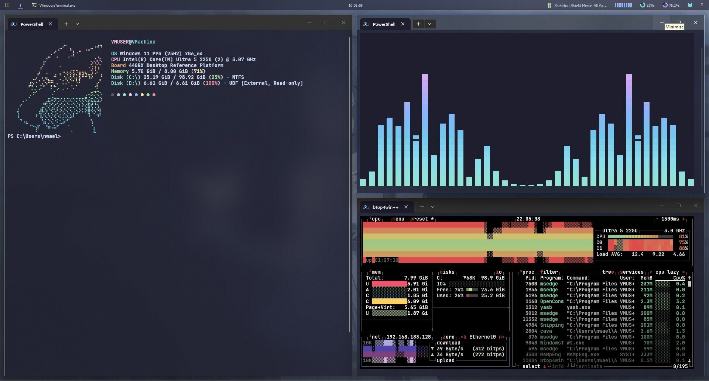
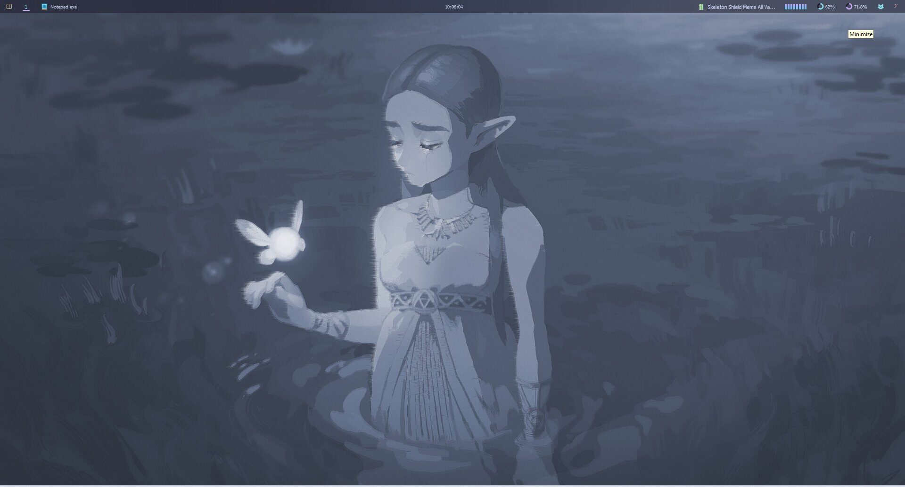
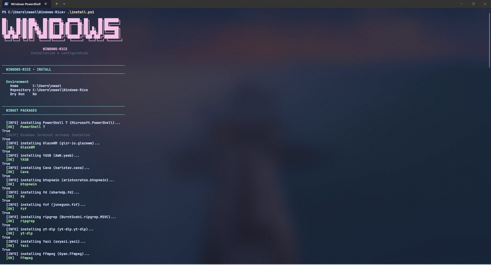
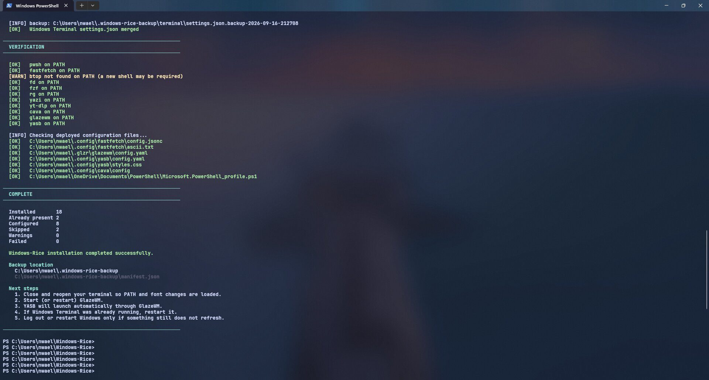

# Windows-Rice

[](#requirements)
[](#requirements)
[](#license)
[](#themes)
[](#what-you-actually-get)
[](#the-tui)

A Windows 10/11 rice you install once. GlazeWM, YASB, Starship, and a curated pile of CLI tools, deployed by a PowerShell script that knows how to say sorry. Plus a menu-driven TUI for every action after install, so you don't have to remember any flags.

**One command to install. One command to undo. One command to change everything else. Zero "well, actually, you'll need to manually edit the registry."**

```powershell
git clone https://github.com/NitroBeast76/Windows-Rice.git
cd Windows-Rice
.\install.ps1
```

That's it. Really. If this README were a mile longer, you'd still only need those three lines. After that, `win-rice` opens the TUI and you never type another flag.



<details>
<summary>More screenshots (click if you're on the fence)</summary>







</details>

---

## Contents

- [Windows-Rice](#windows-rice)
  - [Contents](#contents)
  - [Why this exists](#why-this-exists)
  - [What you actually get](#what-you-actually-get)
    - [Desktop / UI](#desktop--ui)
    - [CLI tools](#cli-tools)
    - [New in 1.4](#new-in-14)
    - [New in 1.3](#new-in-13)
    - [New in 1.2](#new-in-12)
    - [Fonts](#fonts)
    - [PowerShell](#powershell)
  - [Themes](#themes)
    - [Switching themes](#switching-themes)
    - [How themes actually work](#how-themes-actually-work)
    - [Adding your own theme](#adding-your-own-theme)
  - [The TUI](#the-tui)
    - [Launching it](#launching-it)
    - [What it does](#what-it-does)
    - [What it doesn't do](#what-it-doesnt-do)
    - [Removing the launcher](#removing-the-launcher)
  - [Repository structure](#repository-structure)
  - [Requirements](#requirements)
    - [If you'll use `-Update` or modify the repo](#if-youll-use--update-or-modify-the-repo)
    - [If you cloned before October 2026](#if-you-cloned-before-october-2026)
  - [Installation](#installation)
    - [If Windows says "no"](#if-windows-says-no)
    - [What the installer does](#what-the-installer-does)
  - [Installer options](#installer-options)
    - [Examples that will actually help you](#examples-that-will-actually-help-you)
    - [About `-SkipPackages`](#about--skippackages)
  - [After the install](#after-the-install)
    - [1. Open a new terminal](#1-open-a-new-terminal)
    - [2. Start GlazeWM](#2-start-glazewm)
    - [3. Try the TUI](#3-try-the-tui)
    - [4. Configure Flow Launcher](#4-configure-flow-launcher)
    - [5. Configure Windhawk](#5-configure-windhawk)
    - [6. Log out if something is still stale](#6-log-out-if-something-is-still-stale)
  - [CLI tools cheat sheet](#cli-tools-cheat-sheet)
    - [A few that change how you work](#a-few-that-change-how-you-work)
    - [When a command says "not recognized"](#when-a-command-says-not-recognized)
  - [Configuration locations](#configuration-locations)
  - [Startup chain](#startup-chain)
  - [Windows Terminal](#windows-terminal)
  - [Backups \& Safety](#backups--safety)
  - [Installation manifest](#installation-manifest)
  - [Uninstallation](#uninstallation)
    - [Options](#options)
    - [Examples](#examples)
    - [What the launcher removal does](#what-the-launcher-removal-does)
  - [Wallpapers](#wallpapers)
    - [Current limitation](#current-limitation)
    - [Want more wallpapers?](#want-more-wallpapers)
    - [Compressing new wallpapers](#compressing-new-wallpapers)
  - [Customization](#customization)
  - [Updating the rice](#updating-the-rice)
  - [Current limitations](#current-limitations)
  - [Design philosophy](#design-philosophy)
  - [Credits](#credits)
  - [License](#license)

---

## Why this exists

Windows ricing is stuck in the "here's my dotfiles, figure it out" era. You find someone's gorgeous desktop, clone their repo, and discover that it assumes you:

- Already have PowerShell 7, Scoop, and three CLI tools you've never heard of
- Know where each config file is *supposed* to live
- Are okay with their script silently overwriting your existing setup
- Somehow also want to become a system administrator

Windows-Rice tries to be what those repos aren't: an actual installer. It backs things up. It tells you what it's about to do. It has an uninstaller, which is the rarest creature in the ricing ecosystem.

It also has themes and a TUI now, which means you can change how it looks without becoming a CSS archaeologist or memorizing PowerShell flags.

---

## What you actually get

### Desktop / UI

| Component | Role |
|---|---|
| **GlazeWM** | Tiling window manager. Your windows will line up like they mean it. |
| **YASB** | Status bar at the top. Shows time, music, CPU, and whether your RAM is as sad as your wallet. |
| **CAVA** | Audio visualizer, embedded in the bar. Yes, it will pulse when the bass drops. |
| **Starship** | The prompt. Rust binary, ~100ms to initialize, palette follows the active theme. |
| **Fastfetch** | System info printed on shell start. Runs on every new terminal because vanity is a valid use case. |
| **Windows Terminal** | The terminal host. Yes, the one Microsoft makes. No, we're not switching to Wezterm today. |
| **PowerShell 7** | The shell. The one that actually works. |
| **`win-rice`** | The TUI. One command for everything after install. See [The TUI](#the-tui). |

### CLI tools

`btop` (resource monitor), `fd` (`find` that isn't stuck in 1985), `fzf` (fuzzy finder), `ripgrep` (`grep` but it's fast enough to finish before you do), `yazi` (terminal file manager with previews), `yt-dlp` (the internet's favorite "save that video" tool), `ffmpeg`, `7-Zip`, `jq`, `zoxide`, `ImageMagick`.

If you don't know what half of those do, install and find out. That's the fun part.

### New in 1.4

| Component | Role |
|---|---|
| **`rice.ps1`** | Menu-driven TUI. Change theme, update, check status, create a theme, uninstall. Dispatches to `install.ps1` and `uninstall.ps1` with the right flags. |
| **`win-rice`** | Launcher shim. Installed to `~/.local/bin/win-rice.cmd` and added to user PATH. Works from any shell and from `Win+R`. Removed by `uninstall.ps1`. |

### New in 1.3

| Component | Role |
|---|---|
| **Starship** | The prompt. Rust binary, ~100ms init, palette is defined per-theme in `starship.toml`. Deployed as a single file at `~/.config/starship.toml` (Starship's own convention — not a folder). |

### New in 1.2

| Component | Role |
|---|---|
| **ChronoTerm** | A terminal clock. Yes, a clock. In your terminal. With a config file. Ricing is about joy, not utility. |
| **cmatrix** | The falling green code from The Matrix, for Windows. Native C port of the original, no MSYS2 or Cygwin needed. |
| **btop config** | `color_theme = "TTY"`, so btop follows your terminal palette automatically. Change the theme, btop changes too. |
| **Themes** | Full theme system. See below. |
| **Live theme swap** | Switching themes tells GlazeWM to reload its config and re-applies the theme's default wallpaper. No manual `Alt+Shift+R`. |

### Fonts

The canonical font is **JetBrainsMono Nerd Font Mono**. The installer grabs it from Scoop's `nerd-fonts` bucket. If the exact Mono variant can't be resolved it falls back to the non-Mono variant so nothing actually breaks.

Other Nerd Fonts (Fira Code, Hack, Caskaydia Cove, Meslo, Victor Mono) live in the same bucket if you want them, but the rice's own configs only reference JetBrainsMono. Mixing fonts across the rice is how you end up with tofu boxes in your status bar.

### PowerShell

The PowerShell profile is small and does three things:

- Sets UTF-8 I/O encoding
- Runs Fastfetch
- Initializes Starship

Starship is the prompt: a single Rust binary with sub-100ms startup cost, palette driven by the active theme. No Oh My Posh. No prompt framework that needs a compilation step. The profile stays short because Starship does the rendering, and Starship is fast enough that you won't notice it running.

The Starship init line is guarded by a `Get-Command` check, so a `-SkipPackages` install on a machine without Starship yet won't throw on every shell open — it just falls back to the bare PowerShell prompt until you install Starship.

---

## Themes

The rice ships with ten themes. One is the base config, nine are overrides.

| Theme | Notes |
|---|---|
| `mocha` | The default. Catppuccin Mocha. Lives in `configs/`, not in `themes/`. Yes, we know that's inconsistent. It works. |
| `ayu-dark` | Deep navy with a warm orange accent. Lean — one wallpaper. |
| `dracula` | Purple and pink on near-black. The palette with a cult following. |
| `everforest` | Muted greens. Feels like a cabin. |
| `gruvbox` | Retro warm browns and oranges. The one true terminal aesthetic. |
| `kanagawa` | Hokusai colors. Blue and gold. Elegant. |
| `monochrome` | Black and white. Semantic colors collapse into each other. On purpose. Aesthetic. |
| `nord` | Cool arctic blues and greys. Cold, but in a good way. |
| `rose-pine` | Soft purples and pinks. The "it's 11 PM and I'm still coding" theme. |
| `tokyo-night` | Neon Tokyo. Blue-purple with cyan highlights. |

Each theme selects its own Starship palette from the shared `starship.toml`, so the prompt color changes along with everything else when you swap.

### Switching themes

The TUI way:

```powershell
win-rice
# pick "Change theme", pick a theme, done
```

The script way:

```powershell
.\install.ps1 -Theme kanagawa -SkipPackages -SkipFonts
```

Either path deploys in ~5 seconds. Your terminal, YASB bar, Cava gradient, Starship prompt, Fastfetch logo, wallpaper, and GlazeWM config all swap at once — GlazeWM gets told to reload itself, no manual keypress needed.

### How themes actually work

Each theme is a folder under `themes/<name>/` that mirrors `configs/`. Files present in the theme folder override the base. Files absent fall through.

```
themes/kanagawa/
├── yasb/styles.css
├── yasb/default_yasb_config.yaml   (optional — only if layout differs)
├── glazewm/default_glazewm_config.yaml (optional)
├── cava/config
├── fastfetch/config.jsonc
├── fastfetch/ascii.txt
├── starship/starship.toml
├── terminal/settings.json
├── chronoterm/config.toml
└── wallpapers/
    ├── default.jpg
    └── ... your wallpapers
```

**`mocha` is a reserved name.** It refers to the base configs in `configs/` — there is no `themes/mocha/` folder. Running `-Theme mocha` is the same as running with no theme at all. Both deploy the base configs.

The active theme is recorded in the manifest. A plain `.\install.ps1` afterward respects your last choice. No "wait, why did my bar turn magenta again."

**The wallpaper follows the theme.** On first install, the theme's `default.*` wallpaper gets applied. On a theme swap, the new theme's wallpaper replaces it. On a re-run with the same theme, it's left alone — so if you've picked your own wallpaper since, that choice survives.

### Adding your own theme

The TUI has a "Create a new theme" option that scaffolds a folder from any existing theme, prompts for wallpapers, and opens Explorer when it's done.

The script way:

```powershell
.\scaffold-theme.ps1 -Names gruvbox-dark
```

Either path creates a new folder under `themes/`, pre-populated with the base config files. Then edit `yasb/styles.css` (colors), `starship/starship.toml` (palette block), `terminal/settings.json` (scheme name), and `chronoterm/config.toml` (accent color). Drop wallpapers in `wallpapers/` and apply with `-Theme <your-name>`.

Before committing new themes, run:

```powershell
.\compress-all-themes.ps1
```

That resizes every wallpaper to 1920 wide, converts large PNGs to JPEG, and strips metadata. It typically takes 50–100 MB of raw images down to 3–8 MB.

No installer changes needed to add a theme. No PRs to this repo needed. Just ship it.

---

## The TUI

`rice.ps1` is a menu-driven front-end for everything the installer does. It reads state from the manifest, dispatches to `install.ps1` and `uninstall.ps1` as child processes with the right flags, and returns to the menu after each action. No flags to remember. No paths to type.

```
  Windows-Rice
  ============

  Current theme: kanagawa
  Last updated:  2026-10-08 19:27

  1  Change theme
  2  Update
  3  Status
  4  Create a new theme
  5  Uninstall
  0  Exit

  Choice: _
```

### Launching it

**First time, before install:** open a shell in the repo and run `.\rice.ps1`. The menu shows a single "Install" option, because there's no manifest yet.

**After install:** `win-rice` works from any shell, any terminal, and from `Win+R`. The installer writes a `.cmd` shim to `~/.local/bin/` and adds that folder to your user PATH. Windows resolves `.cmd` files from PATH by default, so the command just works.

The shim prefers `pwsh` and falls back to `powershell.exe`, so it works on a fresh Windows install before PowerShell 7 is present.

> **First-run PATH refresh.** Adding a folder to the user PATH only affects processes started after the change. The shell you ran the installer in won't see `win-rice` until you open a new one — and Windows Terminal itself needs to be restarted from a process that has the new environment. The reliable trigger is a log out / log in, or `Stop-Process -Name explorer -Force` (Explorer restarts automatically within a few seconds and hands the updated environment to new processes). After that, `win-rice` resolves everywhere.

### What it does

| Menu item | Under the hood |
|---|---|
| **Install** | `install.ps1 -Theme <picked>` |
| **Change theme** | `install.ps1 -Theme <picked> -SkipPackages -SkipFonts` |
| **Update** | `install.ps1 -Update -SkipPackages -SkipFonts` |
| **Status** | Reads the manifest directly — current theme, install date, deployed config paths |
| **Create a new theme** | Scaffolds a folder from an existing theme, prompts for name and wallpapers, offers to open Explorer |
| **Uninstall** | `uninstall.ps1` with optional `-RemovePackages` and `-Purge` |

Child process output streams live. You see the installer's full banner, per-package progress, and summary exactly as if you'd run it manually.

### What it doesn't do

Deliberately minimal. The TUI is a launcher, not a control panel.

- **No config editing.** Editing YAML in a TUI is worse than opening VS Code.
- **No wallpaper browsing.** YASB has a gallery (`Alt+W`). That's the wallpaper UI.
- **No package cherry-picking.** Full install, full uninstall, no in-between. `-SkipPackages` covers the fast path.
- **No theme previews.** Renders require applying the theme. Pick, apply, look, change if you don't like it — five-second loop.
- **No git operations beyond `-Update`.** No branches, no commits, no "save my changes." Use git for git.
- **No subcommands.** `win-rice` opens the menu, period. If you want flags, use `install.ps1` directly.

Every one of these is a temptation to build, and each one doubles the surface area of the TUI without solving the actual problem it exists for: letting people use the rice without memorizing flags.

### Removing the launcher

`uninstall.ps1` removes `~/.local/bin/win-rice.cmd` automatically. It leaves `~/.local/bin/` itself in place, since the other tool folders (thide, chronoterm, cmatrix, glaze-autotiler) live under it and other projects may use the folder too.

To remove it without running the full uninstaller:

```powershell
Remove-Item "$env:USERPROFILE\.local\bin\win-rice.cmd" -Force
```

The TUI itself (`rice.ps1`) stays in the repo. You can always launch it directly with `.\rice.ps1` from the repo root, and re-running `install.ps1` recreates the shim.

---

## Repository structure

```text
Windows-Rice/
├── install.ps1
├── uninstall.ps1
├── rice.ps1
├── scaffold-theme.ps1
├── compress-all-themes.ps1
├── README.md
├── LICENSE
├── configs/                     # base configs = the "mocha" theme
│   ├── yasb/
│   │   ├── default_yasb_config.yaml
│   │   └── styles.css
│   ├── glazewm/
│   │   └── default_glazewm_config.yaml
│   ├── cava/
│   │   └── config
│   ├── fastfetch/
│   │   ├── ascii.txt
│   │   └── config.jsonc
│   ├── btop/
│   │   └── btop.conf
│   ├── chronoterm/
│   │   └── config.toml
│   ├── powershell/
│   │   └── Microsoft.PowerShell_profile.ps1
│   ├── starship/
│   │   └── starship.toml
│   └── terminal/
│       └── settings.json
├── themes/                      # override themes
│   ├── ayu-dark/
│   ├── dracula/
│   ├── everforest/
│   ├── gruvbox/
│   ├── kanagawa/
│   ├── monochrome/
│   ├── nord/
│   ├── rose-pine/
│   └── tokyo-night/
├── assets/
│   ├── icons/
│   ├── wallpapers/
│   └── screenshots/
└── scripts/
```

| Path | What it is |
|---|---|
| `install.ps1` | The installer. Also the config deployer, the theme swapper, the updater, the launcher installer, and the backup system. |
| `uninstall.ps1` | The uninstaller. Restores your old configs, removes the launcher, and uninstalls only the packages this installer actually installed. |
| `rice.ps1` | The TUI. Menu-driven front-end that dispatches to `install.ps1` and `uninstall.ps1`. |
| `scaffold-theme.ps1` | Creates a new theme folder pre-populated with base config files. |
| `compress-all-themes.ps1` | Compresses every wallpaper in `themes/`. Run before committing new themes. |
| `configs/` | Base config templates. This is `mocha`. |
| `themes/` | Per-theme overrides. Folder names are theme names. |
| `assets/wallpapers/` | Base wallpapers, used when a theme doesn't provide its own. |
| `assets/screenshots/` | README images. Not deployed. |
| `scripts/` | Empty. Reserved for the future. It's been reserved for a while. |

---

## Requirements

- Windows 10 or Windows 11.
- PowerShell 5.1 or later to *run* the installer (the installer will install PowerShell 7 for the rice).
- `winget` (App Installer from the Microsoft Store).
- `git` if you're cloning. If you downloaded a ZIP, no `git` needed — but also, no `-Update` for you. That's the trade-off.

**No administrator privileges required.** Everything installs per-user. Scoop goes into your profile, configs go into your home directory, the launcher shim goes into `~/.local/bin/`, and nothing touches Program Files.

If you *want* to run it as admin, you can. It won't change anything — but the rice won't be visible in your normal user session. Don't do that.

### If you'll use `-Update` or modify the repo

The installer doesn't need a git identity — it just reads and copies files. But if you plan to run `.\install.ps1 -Update` after editing anything under `configs/`, or if you want to fork the repo and add your own theme, git needs to know who you are. One-time setup:

```powershell
git config --global user.name "Your Name"
git config --global user.email "you@example.com"
```

Without this, `git pull` will fail with `Committer identity unknown` when the local branch has diverged from the remote and git tries to create a merge commit. A plain `git clone` and `.\install.ps1` work fine without it.

### If you cloned before October 2026

The repository's git history was rewritten once, to purge large wallpaper files from old commits. Clones made before that rewrite share no common ancestor with the current `origin/main` — every commit hash is different.

`git pull` will fail with one of:

- `Committer identity unknown` — git tries to create a merge commit, which needs a configured identity
- `refusing to merge unrelated histories`

The fix is a one-time reset:

```powershell
git fetch origin
git reset --hard origin/main
```

That discards any local commits and uncommitted changes, and points your branch at the current remote. After it runs, `.\install.ps1 -Update` works normally. This won't happen again — no future changes will rewrite history.

---

## Installation

```powershell
git clone https://github.com/NitroBeast76/Windows-Rice.git
cd Windows-Rice
.\install.ps1
```

If you'd rather pick a theme up-front, add `-Theme <name>`:

```powershell
.\install.ps1 -Theme kanagawa
```

You can also just run `.\rice.ps1` from the repo. The menu detects that no manifest exists and offers a single "Install" option, which prompts for a theme and runs the full install. Same result, fewer typed flags.

### If Windows says "no"

Windows ships with an execution policy that blocks scripts downloaded from the internet. This is, in order of commonness, either:

1. Genuine security feature
2. Mild inconvenience
3. A personal attack on your afternoon

If `.\install.ps1` fails with `UnauthorizedAccess`, either:

```powershell
PowerShell -ExecutionPolicy Bypass -File .\install.ps1
```

which bypasses the policy for one invocation, or:

```powershell
Set-ExecutionPolicy -Scope CurrentUser -ExecutionPolicy RemoteSigned
```

which sets it once for your user account. `RemoteSigned` means "scripts signed by a trusted publisher, or written locally, are fine." For a repo you cloned yourself, this is a reasonable long-term setting.

### What the installer does

In order:

1. Figures out where the repository lives (from the location of `install.ps1`).
2. Resolves your home directory, Documents folder, and per-user config paths. Uses the Windows API where needed — which matters because OneDrive likes to move things around without telling you.
3. Installs packages via `winget` and Scoop (unless `-SkipPackages`).
4. Installs the Nerd Font (unless `-SkipFonts` or `-SkipPackages`).
5. Deploys configuration files.
6. Deploys wallpapers.
7. Creates the `win-rice` launcher shim at `~/.local/bin/win-rice.cmd`, and adds `~/.local/bin/` to your user PATH if it's not already there.
8. Tells GlazeWM to reload its config, if it's running.
9. Ensures PSReadLine is present (skipped under `-SkipPackages`).
10. Merges your Windows Terminal `settings.json` (unless `-SkipTerminal`).
11. Writes an installation manifest.
12. Verifies the result.
13. Prints a summary.

Everything in steps 3–10 is backed up before it overwrites anything. Everything.

Step 7 runs even with `-SkipPackages`, because the launcher isn't a package — it's a config-file artifact like the rest.

---

## Installer options

| Option | Effect |
|---|---|
| `-Theme <name>` | Use a specific theme. `mocha` refers to the base configs. |
| `-Update` | Run `git pull --ff-only` before doing anything else. |
| `-SkipPackages` | Skip all package installation. Implies `-SkipFonts`. Config deployment still runs. |
| `-SkipFonts` | Skip the Nerd Font install. |
| `-SkipTerminal` | Don't touch Windows Terminal settings. |
| `-DryRun` | Show what would happen. Change nothing. |
| `-Yes` | Auto-yes to prompts. For unattended runs. |

### Examples that will actually help you

```powershell
# Preview the install. Changes nothing. Perfect for "do I trust this repo."
.\install.ps1 -DryRun

# Deploy configs only, leave Windows Terminal alone
.\install.ps1 -SkipTerminal

# Deploy configs but don't install anything
.\install.ps1 -SkipPackages -SkipFonts

# Swap to Kanagawa (fast — assumes packages are already installed)
.\install.ps1 -Theme kanagawa -SkipPackages -SkipFonts

# Pull the latest from GitHub, then reinstall
.\install.ps1 -Update

# Pull, redeploy, swap theme, all in one
.\install.ps1 -Update -Theme rose-pine -SkipPackages -SkipFonts
```

### About `-SkipPackages`

`-SkipPackages` is the "do not install anything" switch. It's the nuclear option for when you just want the config files swapped.

- It **does** skip: winget, Scoop, the Nerd Font, PSReadLine, Thide, GlazeWM AutoTiler, Flow Launcher, Windhawk, ChronoTerm, cmatrix.
- It **does not** skip: config deployment, wallpaper deployment, launcher creation, WT merge, the GlazeWM reload.

If you want a fast theme swap, use `-SkipPackages -SkipFonts`. The install finishes in seconds because there's nothing left to install.

---

## After the install

The installer puts everything on disk. But four components need a first launch before they do anything useful. This is the part most READMEs gloss over, and then you get issues on GitHub saying "the bar isn't showing."

### 1. Open a new terminal

Close the one you ran the installer in and open a fresh one. This loads the updated PATH (including `~/.local/bin`, so `win-rice` resolves) and picks up the Nerd Font.

If `win-rice` still isn't found in the fresh shell, the parent process — Windows Terminal, or the desktop Explorer session — started before the PATH change. Restart Explorer (`Stop-Process -Name explorer -Force`) or log out and back in. That's the reliable fix for any "command was just installed but doesn't resolve" situation on Windows.

### 2. Start GlazeWM

```powershell
glazewm
```

GlazeWM reads its config on startup and launches two things for you:

- **YASB** — the status bar
- **GlazeWM AutoTiler** — the tiling helper

The bar should appear at the top of your screen within a second or two. The AutoTiler tray icon shows up in the notification area (bottom-right, possibly behind the `^` arrow).

**Keybindings to know:**

| Keys | Action |
|---|---|
| `Alt + H/J/K/L` | Focus windows (vim style) |
| `Alt + Shift + H/J/K/L` | Move windows |
| `Alt + 1..9` | Switch workspaces |
| `Alt + Shift + Q` | Close window |
| `Alt + F` | Fullscreen |
| `Alt + V` | Open Windows Terminal |
| `Alt + W` | Wallpaper gallery |
| `Alt + Space` | Flow Launcher |
| `Alt + Shift + E` | Exit GlazeWM |
| `Alt + Shift + R` | Reload config |

### 3. Try the TUI

```powershell
win-rice
```

Opens the menu. From here you can change theme, update, check status, create a new theme, or uninstall — all without remembering a single flag. This is the intended way to use the rice after install.

### 4. Configure Flow Launcher

Open **Flow Launcher** from the Start Menu (there's no `flow` CLI shim, don't try to type it). First run walks you through theme and indexing. Once done, `Alt+Space` opens it.

Since Thide hides the taskbar, Flow Launcher is your primary "launch programs by name" tool. It replaces the Start menu search you no longer have.

### 5. Configure Windhawk

Open **Windhawk** from the Start Menu. **No mods are installed by default** — the installer only puts the platform in place.

Windhawk runs mods *inside* Windows system processes. A bad mod can crash Explorer. Install them one at a time and test between each. Good starters:

- `explorer-frame-styler` — subtle Explorer theming
- `start-menu-styler` — Start menu theming

Taskbar mods are useless here because Thide hides the taskbar.

### 6. Log out if something is still stale

Fonts, PATH changes, and some shell extensions refresh only on login. If your terminal font still looks wrong or `win-rice` still doesn't resolve after step 1, log out and back in. This is the correct answer approximately 95% of the time when ricing breaks in a way that makes no sense.

---

## CLI tools cheat sheet

None of these require configuration. They work from any shell once PATH is refreshed.

| Tool | What it does | Try it |
|---|---|---|
| `fastfetch` | System info on shell start | `fastfetch` |
| `btop` | Resource monitor | `btop` |
| `fd` | `find`, but modern | `fd config` |
| `rg` | `grep`, but fast | `rg "TODO" .` |
| `fzf` | Fuzzy finder | `ls \| fzf` |
| `zoxide` | Smart `cd` | `z project` (after `cd`-ing once) |
| `yazi` | Terminal file manager | `yazi` |
| `yt-dlp` | Media downloader | `yt-dlp <url>` |
| `ffmpeg` | Media conversion | `ffmpeg -i in.mp4 out.mkv` |
| `7z` | Archives | `7z x archive.zip` |
| `jq` | JSON processor | `curl ... \| jq .` |
| `magick` | Image manipulation | `magick input.png -resize 50% out.png` |
| `cava` | Audio visualizer | (runs inside YASB) |
| `thide` | Hide/show taskbar | `thide hide` / `thide show` |
| `chronoterm` | Clock in your terminal | `chronoterm` |
| `cmatrix` | Falling code | `cmatrix` |
| `starship` | The prompt | (runs on every prompt) |
| `win-rice` | The TUI | `win-rice` |

### A few that change how you work

**`zoxide`** learns from where you `cd`. After a few days, `z proj` jumps to whatever project directory you visit most. Enable tab completion with `zoxide init powershell | Out-String | Invoke-Expression` in your profile.

**`fzf`** is at its best piped. `git branch | fzf` picks a branch. `cat file | fzf` searches inside it. Bare `fzf` opens a file selector in the current directory.

**`yazi`** is a full file manager with previews, archives, and batch ops. Vim keybinds: `hjkl` to move, `Enter` to open, `y` to yank, `p` to paste. Press `~` for the cheat sheet.

**`magick`** is what the rice uses to resize wallpapers before deploying. If you want to prep your own:

```powershell
magick input.jpg -resize 1920x -strip "$HOME\Pictures\Windows-Rice\my-wallpaper.jpg"
```

Caps width at 1920, preserves aspect ratio, strips metadata. Same command the shrink script uses.

**`win-rice`** is the one you'll actually type most often. Everything else here runs on demand — the TUI is how you *manage* the rice without opening the repo folder.

**`chronoterm`** and **`cmatrix`** are "just because you can." There's no productivity gain. There is, however, a clock and a Matrix effect. That's the point.

### When a command says "not recognized"

Close and reopen the terminal. This fixes it 90% of the time because PATH changes only apply to new shells.

If it still doesn't work:

```powershell
winget list --id sharkdp.fd --exact   # replace with whichever tool
```

If the package shows as installed but the command isn't found, see *Current Limitations* — btop is the notorious one.

---

## Configuration locations

Everything deploys under your home directory. The installer resolves `~` from `$env:USERPROFILE`, so no usernames are hardcoded anywhere.

| Source | Destination |
|---|---|
| `configs/yasb/default_yasb_config.yaml` | `~/.config/yasb/config.yaml` |
| `configs/yasb/styles.css` | `~/.config/yasb/styles.css` |
| `configs/glazewm/default_glazewm_config.yaml` | `~/.glzr/glazewm/config.yaml` |
| `configs/cava/config` | `~/.config/cava/config` |
| `configs/fastfetch/config.jsonc` | `~/.config/fastfetch/config.jsonc` |
| `configs/fastfetch/ascii.txt` | `~/.config/fastfetch/ascii.txt` |
| `configs/btop/btop.conf` | `~/.config/btop/btop.conf` |
| `configs/chronoterm/config.toml` | `%APPDATA%\chronoterm\config.toml` |
| `configs/powershell/Microsoft.PowerShell_profile.ps1` | `~/Documents/PowerShell/Microsoft.PowerShell_profile.ps1` |
| `configs/starship/starship.toml` | `~/.config/starship.toml` |
| `configs/terminal/settings.json` | Merged into Windows Terminal's user `settings.json` |
| `assets/wallpapers/**` | `~/Pictures/Windows-Rice/**` |
| *(generated)* | `~/.local/bin/win-rice.cmd` — launcher shim |
| Backups and manifest | `~/.windows-rice-backup/` |

**The launcher shim is generated, not copied.** Unlike every other deployed file, `win-rice.cmd` doesn't exist in the repo. `install.ps1` writes it fresh, baking in the repo path at install time. If you move the repo, re-run `install.ps1` from the new location — the shim will be rewritten to point at the correct path. Uninstall removes it.

**Starship uses one file, not a folder.** `~/.config/starship.toml` is Starship's documented default location. The repo stores it at `configs/starship/starship.toml` for symmetry with every other component; only the destination differs.

**Fastfetch uses one location:** `~/.config/fastfetch/`. Not two, not three. Not `%APPDATA%`. One.

**OneDrive users, listen up.** On a machine signed in with a Microsoft account, `~/Documents/` often resolves to `~/OneDrive/Documents/`. The installer uses the Windows API to resolve the *effective* Documents folder, so the profile lands wherever PowerShell 7 actually looks. You don't need to do anything. But if you ever wonder why your `~/Documents/PowerShell` folder is empty, that's why.

Same story for `~/Pictures/Windows-Rice/` — resolved via the API so it lands in whatever Pictures folder Windows is using.

---

## Startup chain

GlazeWM launches YASB from its own config. One mechanism, no duplicate launches.

```
Windows logon
      │
      ▼
GlazeWM starts
      │
      ▼
GlazeWM startup_commands → shell-exec → yasb.exe
      │
      ▼
YASB loads ~/.config/yasb/config.yaml + styles.css
```

`shell-exec` is required because GlazeWM parses each entry as one of its own subcommands, not as a raw shell string. You can't just put `yasb.exe` and hope. Well, you can hope. It won't work.

On cold boot, YASB may briefly show its "GlazeWM is offline" message before the IPC pipe is ready. It reconnects within seconds. This is not a bug, it's a race condition that everyone loses gracefully.

**The TUI is not on the startup chain.** `win-rice` only runs when you invoke it. Nothing about the rice starts the menu on boot; you launch it when you want to do something.

---

## Windows Terminal

Windows Terminal's `settings.json` is **merged**, not overwritten. This is a hard design choice, not a "we'll get around to it."

The installer:

- finds the file via the installed `Microsoft.WindowsTerminal` AppX package identity;
- only falls back to a folder scan when exactly one candidate exists;
- reads and parses your existing file;
- reads the repo's `configs/terminal/settings.json` as a patch;
- merges by stable key:
  - `profiles.list` — by `guid` (your custom profiles are preserved)
  - `schemes` — by `name`
  - `actions` and `keybindings` — replaced by `id` for entries the rice owns, so rerunning doesn't duplicate them
  - top-level scalars (`defaultProfile`, `tabWidthMode`, `useAcrylicInTabRow`) — rice wins
- writes a timestamped backup of the original;
- validates the merged JSON before writing.

**If your settings.json is unparseable** — for example because it has JSONC comments that PowerShell 5.1's `ConvertFrom-Json` can't read — the installer leaves the file untouched and reports the WT step as skipped. It does not corrupt your file to force the merge through.

The merge preserves unrelated WSL, SSH, and custom profiles, unrelated schemes, and unrelated keybindings. It is not a general-purpose conflict resolver. It's a "don't break the user's terminal" merger. There's a difference.

---

## Backups & Safety

The installer does not blindly overwrite things. Here's exactly what it does:

Before replacing any file that already exists:

1. Compares source and destination with SHA256.
2. If identical, does nothing. No copy. No backup. No busywork.
3. If different, writes a timestamped backup first.

Backups live under `~/.windows-rice-backup/`, in a layout that mirrors the component:

```text
.windows-rice-backup/
├── manifest.json
├── yasb/
├── glazewm/
├── cava/
├── fastfetch/
├── btop/
├── chronoterm/
├── powershell/
├── starship/
├── terminal/
└── wallpapers/
```

Backup filenames include a timestamp:

```text
config.yaml.backup-2026-09-15-203000
```

**The backup system only touches files this project manages.** It's not a system-wide backup tool. It's not a Time Machine. It doesn't care about your photos.

The launcher shim is the one deployed artifact that has no backup — because there's nothing to back up. It's generated fresh every run, and uninstall removes it outright.

---

## Installation manifest

`install.ps1` records the packages it *actually installed* in:

```text
~/.windows-rice-backup/manifest.json
```

Packages that were already present before the installer ran are marked `AlreadyInstalled` and are **not** added to the manifest. This is the manifest's entire purpose.

`uninstall.ps1 -RemovePackages` reads the manifest. If a package isn't in it, that package isn't touched. Ever. This means:

- You had GlazeWM before running the rice? Uninstaller leaves it.
- You had PowerShell 7 before running the rice? Uninstaller leaves it.
- You had YASB before running the rice? Well, you had good taste, and uninstaller leaves it.

If the manifest is missing or unreadable, package removal is skipped entirely with a warning. Restoring configs still runs. Conservative by design — we'd rather leave software installed than uninstall something you didn't ask us to uninstall.

The manifest also drives the TUI. `rice.ps1` reads it to determine whether the menu shows the "Install" variant (no manifest) or the "Change theme / Update / Status / Create theme / Uninstall" variant (manifest exists). Corrupt manifest → treat as not installed → install rewrites it.

**The manifest is a record of what this installer did.** It is not a full inventory of your machine. Don't use it as one.

---

## Uninstallation

```powershell
.\uninstall.ps1
```

Or via the TUI:

```powershell
win-rice
# pick "Uninstall"
```

Both paths do the same thing. Default behaviour restores config files from backups where backups exist, removes the `win-rice` launcher shim, and leaves freshly-deployed files (no prior version on disk) in place.

### Options

| Option | What it does |
|---|---|
| `-RemovePackages` | Uninstall the packages recorded in the manifest. PowerShell 7 and Windows Terminal are deliberately kept. |
| `-Purge` | Also delete `~/.windows-rice-backup/` and everything in it. Prompts for confirmation. |
| `-DryRun` | Show what would happen. Change nothing. |
| `-Yes` | Auto-yes. For unattended runs. |

### Examples

```powershell
# Restore configs, remove the launcher. Keep the packages.
.\uninstall.ps1

# Restore configs, remove the launcher, and uninstall rice-installed packages.
.\uninstall.ps1 -RemovePackages

# Restore, uninstall, and delete all backups too.
.\uninstall.ps1 -RemovePackages -Purge
```

`-RemovePackages` and `-Purge` do different things:

- **`-RemovePackages`** uninstalls only packages the manifest records as installed by Windows-Rice.
- **`-Purge`** removes the backup and manifest data itself, once restoration is done.

If no manifest exists, `-RemovePackages` prints a warning and performs no removal. This is intentional. It means you can't accidentally run the rice uninstaller on a machine that has never had the rice installed and have it start deleting things.

### What the launcher removal does

`uninstall.ps1` deletes `~/.local/bin/win-rice.cmd` if it exists. `win-rice` stops resolving after that. The `~/.local/bin/` folder itself stays — the other tool folders live under it and removing the parent would be destructive beyond what this uninstaller is scoped to.

`rice.ps1` stays in the repo. If you want the TUI back, run `.\rice.ps1` directly from the repo root, or re-run `install.ps1` to recreate the shim.

---

## Wallpapers

Wallpapers live in two places:

- `assets/wallpapers/` — the base set, used when a theme doesn't provide its own
- `themes/<name>/wallpapers/` — theme-specific wallpapers, which **replace** the base set entirely for that theme

The installer deploys them to `~/Pictures/Windows-Rice/` (resolved via the API, so OneDrive-safe) and sets `default.*` as your desktop wallpaper on first install.

**The wallpaper follows the theme.** When you swap themes, the new theme's `default.*` gets applied. Re-running with the same theme leaves your wallpaper alone — so if you've picked your own since, that choice survives.

YASB's wallpaper widget points at that folder, so everything shows up in the gallery (`Alt+W`).

Each wallpaper goes through the same backup path as every other managed file. If a same-named file already exists in the destination, it's backed up before being replaced. Uninstall restores backed-up originals.

### Current limitation

Wallpapers deployed fresh — meaning they replaced nothing because no file of that name existed before — are left in place after uninstall. The backup system can only restore files that had a previous version to back up. Same rule applies to fresh config files.

The empty `~/Pictures/Windows-Rice/` directory is removed by uninstall only when empty. If you've added your own wallpapers to it, they stay.

### Want more wallpapers?

The bundled set is intentionally small — enough to get started, not enough to bloat a git repo. For bigger collections:

- [SleepyCatHey/CozyPixels](https://github.com/SleepyCatHey/CozyPixels/tree/main/Catppuccin) — hundreds of Catppuccin-compatible wallpapers, sorted by category
- [AEON-mod/My-Visuals](https://github.com/AEON-mod/My-Visuals) — themed collections; `dark_amoled` and `cozy_cold` fit this rice best

To add your own, drop files into `assets/wallpapers/` before running `install.ps1`, or copy them into `~/Pictures/Windows-Rice/` after install. YASB picks up new files automatically.

### Compressing new wallpapers

Every theme ships compressed wallpapers — capped at 1920 wide, quality 82, metadata stripped. When adding your own, run them through `compress-all-themes.ps1` before committing:

```powershell
.\compress-all-themes.ps1
```

It converts large PNGs to JPEG, resizes everything to fit 1920×1080, and reports per-theme sizes at the end. Running it on a fresh theme typically reduces 50–100 MB of raw images to 3–8 MB.

---

## Customization

Edit files under `configs/`, rerun `install.ps1`, done. That's the workflow.

| Path | What it controls |
|---|---|
| `configs/yasb/default_yasb_config.yaml` | Bar layout, widget list, widget behaviour |
| `configs/yasb/styles.css` | Colours, spacing, fonts |
| `configs/glazewm/default_glazewm_config.yaml` | Tiling layout, gaps, keybindings |
| `configs/cava/config` | Audio visualizer |
| `configs/fastfetch/config.jsonc` | Fastfetch modules and colours |
| `configs/fastfetch/ascii.txt` | ASCII logo |
| `configs/btop/btop.conf` | btop settings |
| `configs/chronoterm/config.toml` | ChronoTerm clock |
| `configs/powershell/Microsoft.PowerShell_profile.ps1` | Shell startup |
| `configs/starship/starship.toml` | Starship prompt format and palettes |
| `configs/terminal/settings.json` | Rice-owned Terminal settings |
| `themes/<name>/` | Per-theme overrides of any of the above |

**YASB live-reloads.** `watch_stylesheet: true` and `watch_config: true` mean edits to the YASB YAML and CSS take effect without restarting the bar. Everything else needs a rerun of the installer or a manual reload.

**Starship live-reloads too** — well, the next prompt after you save the file. No restart needed.

**Deployed files are not synced back.** If you edit `~/.config/yasb/config.yaml` directly, then rerun the installer, your edits get backed up and replaced. To keep changes, edit the files under `configs/` and re-run.

The backup system makes this recoverable, but it's easier to just do it the right way.

---

## Updating the rice

The TUI way:

```powershell
win-rice
# pick "Update"
```

The script way:

```powershell
.\install.ps1 -Update
```

Both run `git fetch` + `git merge --ff-only` first, then continue with the config redeploy. Use `--ff-only` semantics specifically so local commits don't create merge commits — which is why a fresh Windows install without a git identity can still update without hitting `Committer identity unknown`.

If the local branch has diverged from `origin/main` — for example because the remote history was rewritten — the installer warns, shows what would be lost, and offers to reset to `origin/main`. It defaults to "no". Answer `y` only if you don't have local work you care about.

For a fast "I just want the latest configs":

```powershell
.\install.ps1 -Update -SkipPackages -SkipFonts
```

That pulls, redeploys configs, redeploys wallpapers, re-creates the launcher, merges WT, and skips all the package-checking work. Takes seconds.

**A note on `-Update` and new packages.** When `-Update` pulls a commit that adds a new package to the install list, that package will **not** be installed in the same run. The reason is that the script already loaded into memory is the old version — `git fetch` updates the files on disk, but the running process keeps executing the code it started with.

Two-step fix:

```powershell
.\install.ps1 -Update    # pulls new code, deploys configs
.\install.ps1            # now running the new version — installs any new packages
```

Or run the TUI's Update, then close the TUI and run `win-rice` again and pick Update. Same effect.

---

## Current limitations

**Weather widget.** YASB's weather widget requires an API key and a location, which this repo does not ship. If you want it, edit `api_key` and `location` in the deployed `~/.config/yasb/config.yaml`. The installer won't create an account or embed a key on your behalf. That would be weird.

**btop on PATH.** Winget installs `btop4win` as a portable package and adds its own package folder to PATH — but not the shared `Links` folder that holds the `btop.exe` alias. So `btop4win` may be callable while `btop` isn't. Close and reopen your terminal first. If it still fails, manually add `%LOCALAPPDATA%\Microsoft\WinGet\Links` to your user PATH.

**First-run PATH refresh.** `win-rice` won't resolve in the shell you ran the installer from. Windows only updates new processes' environments. Open a fresh shell, or restart Explorer, or log out and back in. One of those three will fix it.

**Freshly deployed files aren't removed by uninstall.** Files deployed by the installer that had no prior version on disk are left in place. Only files that replaced an existing version can be restored. Same rule applies to wallpapers. The launcher shim is an exception — it has no prior version to preserve, and uninstall removes it unconditionally.

**JSONC in Windows Terminal settings.** If your existing `settings.json` has comments that PowerShell's `ConvertFrom-Json` can't parse, the merge is skipped. The installer doesn't strip comments or modify the file. It leaves it alone.

**PowerShell 5.1 execution policy.** Windows ships with a policy that blocks scripts. If `.\install.ps1` fails with `UnauthorizedAccess`, use `PowerShell -ExecutionPolicy Bypass -File .\install.ps1` or set `RemoteSigned` for the current user.

**Flow Launcher and Windhawk don't install CLI shims.** Launch from the Start Menu. Yes, this is slightly annoying. No, we can't fix it without hacking the installer for those specific tools.

**`-Update` doesn't install new packages in the same run.** See the note in [Updating the rice](#updating-the-rice). Run the installer a second time after pulling.

**The TUI is numbered-menu only.** Arrow-key navigation, colored panels, spinners — all skipped in favor of raw `Read-Host` and ASCII output. This is deliberate. It works in every Windows terminal, in every locale, on every PowerShell version back to 5.1, with zero dependencies. A prettier version is possible but not planned.

---

## Design philosophy

**Automate the boring parts without treating the user's existing Windows setup as disposable.**

In practice:

- **Reproducible.** Same repo, same result on any Windows 10/11 machine. No hardcoded paths, no hardcoded usernames, no "works on my machine."
- **Safe.** Existing config is compared, backed up, and preserved where possible. Nothing is blindly overwritten.
- **Reversible.** Backups and the manifest let `uninstall.ps1` restore files and remove only what this installer put there.
- **Organised.** Configuration lives under predictable per-user locations.
- **Transparent.** The installer prints what it's doing. `-DryRun` shows the plan before anything changes. The TUI streams child-process output live rather than hiding it behind a spinner.
- **Discoverable.** `win-rice` opens a menu of everything the rice can do. The flags still exist — the TUI just spares you from having to remember them.

**The installer is not zero-risk.** It modifies files under your home directory. It installs software. The backup and manifest systems exist to make those changes recoverable — not to make them disappear.

If you don't like what it did, `.\uninstall.ps1 -RemovePackages -Purge` puts things back.

---

## Credits

Windows-Rice configures software made by other people. Upstream projects include:

- **GlazeWM** — tiling window manager for Windows
- **YASB** — status bar
- **CAVA** — audio visualizer
- **Starship** — cross-shell prompt, written in Rust
- **Fastfetch** — system information
- **Windows Terminal**, **PowerShell** — Microsoft
- **btop**, **fd**, **fzf**, **ripgrep**, **yazi**, **yt-dlp**, **FFmpeg**, **7-Zip**, **jq**, **zoxide**, **ImageMagick** — the CLI power tools that make a shell worth using
- **ChronoTerm**, **cmatrix-win**, **Thide**, **GlazeWM AutoTiler**, **Flow Launcher**, **Windhawk** — the extras that make it fun
- **JetBrains Mono** and the **Nerd Fonts** project for the font
- **Catppuccin**, **Ayu**, **Dracula**, **Everforest**, **Gruvbox**, **Kanagawa**, **Nord**, **Rosé Pine**, **Tokyo Night** for the palettes

Upstream URLs are intentionally omitted here until they're verified for this repository.

---

## License

Windows-Rice is released under the MIT License. See [`LICENSE`](LICENSE) for the full text.

The MIT License covers the PowerShell scripts, YAML/CSS/JSON/TOML configuration files, and other original content in this repository. It does not relicense third-party software that Windows-Rice installs or configures, nor the color palettes, fonts, or ASCII art sourced from other projects — those remain under their own licenses and are acknowledged in [Credits](#credits) above.

If you fork this, remix it, and ship something cool, you don't have to credit us. But it would be nice if you did.
